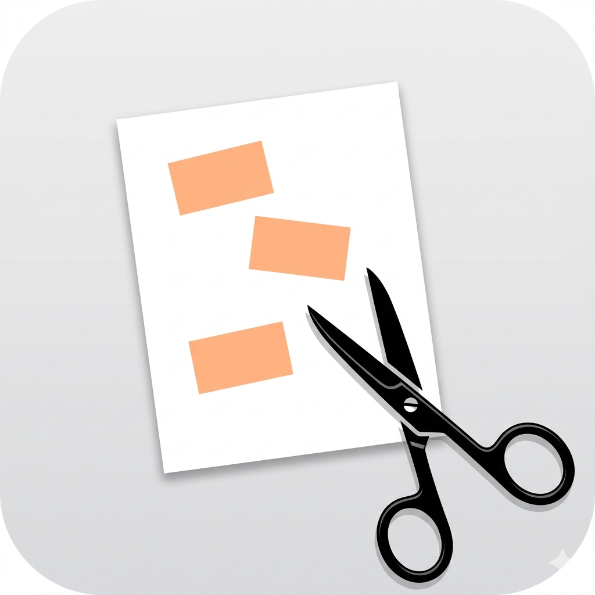

# SVG Viewport Processing Tools



This toolkit processes concept map diagrams to create zoomed-in views of specific sections.

## Overview

When writing articles about complex topics with concept map diagrams, you often want to show zoomed-in sections that focus on specific areas. This toolkit helps create those zoomed views by:

1. **Filtering** elements that extend outside the viewport — either dimming them to 25% opacity or removing them entirely
2. **Cropping** the SVG to the specific rectangular viewport

The workflow applies filtering first (to the full diagram), then crops to ensure proper visual focus on the main content area.

## Input Preparation

1. Create your diagram using a vector diagramming tool such as [TLDraw](https://www.tldraw.com/).

2. Add colored rectangles to mark the regions you want cropped into individual images. If using TLDraw, use **orange** rectangles (stroke `#e16919`) so the command-line examples below work as-is without any changes.

3. Export the diagram as an `.svg` file. Suggested layout:
   ```
   my-post/
     inputs/
       Full.svg      ← exported diagram
     outputs/        ← generated section SVGs will go here
   ```

## Workflow

### Complete Process (Regenerate All Outputs)

To regenerate all outputs from scratch:

```bash
# Extract the input SVG
(cd inputs/ ; unzip Full.svg.zip ; rm -rf __MACOSX)

# Fix text wrapping issues in the SVG
python3 src/svg_fix_text_wrap.py "Pass-Through Method,Comments\n(p. 95-120),Special-General Mixture\n(p. 65)" inputs/Full.svg inputs/Full-nowrap.svg

# Find all viewport rectangles
python3 src/svg_find_viewports.py inputs/Full-nowrap.svg --stroke "#e16919" --out outputs/rectangles.csv

# Generate all sectioned outputs (viewports 0-5), dimming out-of-viewport elements
for i in {0..5}; do python3 src/svg_process_viewport.py inputs/Full-nowrap.svg outputs/section$i.svg $i; done

# Or with out-of-viewport elements removed entirely
for i in {0..5}; do python3 src/svg_process_viewport.py inputs/Full-nowrap.svg outputs/section$i.svg $i --mode remove; done
```

### Quick Start (Individual Viewports)

Use the complete workflow script `svg_process_viewport.py` for one-step processing of individual viewports:

```bash
# Process viewport 0, dimming out-of-viewport elements (default)
python3 src/svg_process_viewport.py inputs/Full-nowrap.svg outputs/section0.svg 0

# Process viewport 0, removing out-of-viewport elements entirely
python3 src/svg_process_viewport.py inputs/Full-nowrap.svg outputs/section0.svg 0 --mode remove

# Use a custom CSV path (default is rectangles.csv in the output directory)
python3 src/svg_process_viewport.py inputs/Full-nowrap.svg outputs/section0.svg 0 --csv /other/path/rectangles.csv
```

### Manual Steps for Debugging (Individual Viewports)

The `svg_process_viewport.py` script can be debugged by running the individual steps manually:

1. **Find viewport rectangles** (orange rectangles in your diagram):
```bash
python3 src/svg_find_viewports.py inputs/Full-nowrap.svg --stroke "#e16919" --out outputs/rectangles.csv
```

2. **Filter elements outside viewport** (dim or remove):
```bash
# Dim to 25% opacity (default)
python3 src/svg_dim_by_bbox.py inputs/Full-nowrap.svg outputs/section0_filtered.svg 0 --csv outputs/rectangles.csv

# Remove entirely
python3 src/svg_dim_by_bbox.py inputs/Full-nowrap.svg outputs/section0_filtered.svg 0 --csv outputs/rectangles.csv --mode remove
```

3. **Crop to specific viewport**:
```bash
python3 src/svg_crop_by_bbox.py outputs/section0_filtered.svg --csv outputs/rectangles.csv --index 0 --pad 0 --hide-stroke "#e16919" --out outputs/section0.svg
```

## Key Features

- **Two filtering modes**: Dim out-of-viewport elements to 25% opacity, or remove them entirely
- **No opacity stacking**: Applies opacity only to top-level groups to avoid visual artifacts
- **Accurate bounds detection**: Parses SVG paths and transforms to determine element positions
- **Viewport-aware filtering**: Only affects elements that extend outside the viewport boundary
- **Preserves element structure**: Maintains the original SVG structure and namespaces

## Files

- `svg_fix_text_wrap.py` - Fix specific text boxes so that their contents do not wrap
- `svg_find_viewports.py` - Finds orange rectangle viewports in SVG, writes `rectangles.csv`
- `svg_dim_by_bbox.py` - Dims or removes elements outside viewport (`--mode dim|remove`, `--csv PATH`)
- `svg_crop_by_bbox.py` - Crops SVG to bounding box
- `svg_process_viewport.py` - Complete workflow script (filter + crop); accepts `--mode` and `--csv`

## Output

The final SVGs will have:
- Cropped viewBox showing only the target area
- Elements fully within viewport at normal opacity (100%)
- Elements extending outside viewport either dimmed to 25% opacity or removed (depending on `--mode`)

## Workflow Details

The correct processing order is **filter first, then crop**:
1. Filtering is applied to the full diagram to identify which elements extend outside the viewport
2. Cropping is then applied to focus on the target area
3. This ensures that filtering decisions are based on the original element positions relative to the viewport
