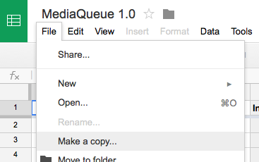
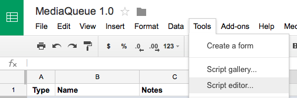
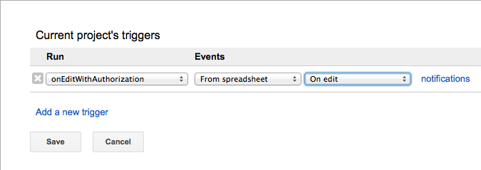
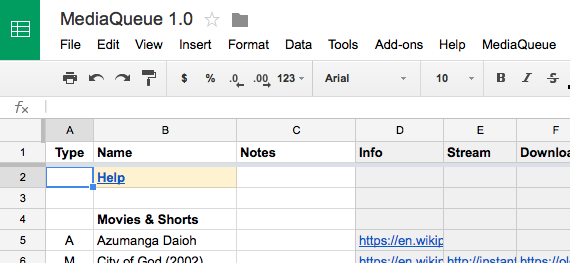
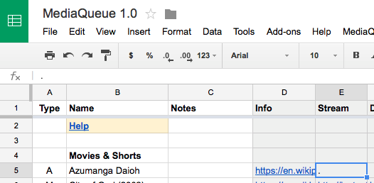
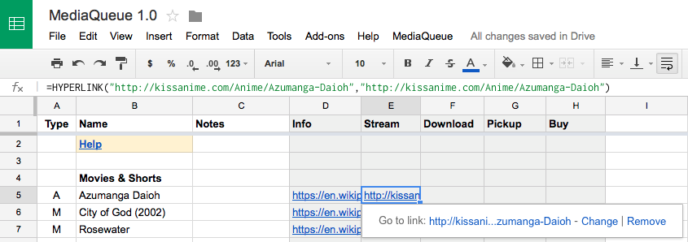

MediaQueue allows you to write down media that you want to watch - movies, TV series, books, etc. - and helps you to quickly locate the media for streaming, download, pickup, or purchase.

MediaQueue is implemented as a Google Docs spreadsheet with custom macros that search for media items entered into the sheet.

    

        
        
        
    

### Supported Media Sources

* Netflix - Stream source for everything
* KissAnime - Stream source for Anime (`A`)
* The Pirate Bay - Download source for everything
* BakaBT - Download source for Anime (`A`)
* Seattle Public Library - Pickup source for everything
* Barnes & Noble - Pickup source for Books (`B`)
* Amazon - Buy source for everything



* [Installation](#installation)
* [Usage](#usage)
* [Contributing](#contributing)



  {{ toc_content | markdownify }}

## Installation

1. Open the spreadsheet:
   
   <a class="btn btn-primary" target="_new" href="https://docs.google.com/spreadsheets/d/1heViK7cdeo3AdjvUP7oGoP5lVPzH9MLQw_CVS8GCnIo/edit#gid=0">Open in Google Docs</a>

2. If you're not already logged in to Google, click the **SIGN IN** link in
   the top-right corner.

3. From the **File** menu select **Make a copy**:
   
   

4. From the **MediaQueue** menu select **Settings...**:
   
   
   
5. Confirm the authorization prompt:
   
   
   
   This will take you to the settings page, which you can leave blank for now.
   
4. Again, from the **MediaQueue** menu select **Settings...**:
   
   
   
   This will take you back to the Queue sheet.

5. From the **Tools** menu select **Script editor...**:
   
   
   
   The script editor will appear in a new tab.

6. From the **Resources** menu select **Current project's triggers**:
   
   
   
   An empty trigger box will appear:
   
   

7. Configure a new edit trigger with the following settings:
   
   
   
8. Click "Save" to dismiss the trigger box.

9. Close the current script editor tab. This will take you back to the Queue sheet:

   

## Usage

### 1. Add an item

To insert a new media item in the queue, insert a new row and type the item name and the item type. Providing a correct item type helps MediaQueue search more relevant media sources in the next step.

Media types currently recognized by the **Type** column include:

* `A` = Anime
* `M` = Movie
* `B` = Book

Multiple types can be specified by separating with commas. For example `M,A` refers to an anime movie.

It's okay to use other ad-hoc media types not in this list. They will be ignored. If a media item contains no recognized media type, only a generic set of media sources that are widely applicable will be searched.

 
### 2. Search for an item

To search for a media item in various media sources, locate the row containing the media item and the gray-colored column that corresponds to the type of media sources you want to search. For example if you wanted to find a stream to watch a media item, you would choose the **Stream** column.

1. Type a period (`.`) in the cell for the row and column you identified. This will summon a new sheet and initiate a search for the media item in various media sources. 

   

2. Once the search is complete select a search result by typing the number of your choice into the yellow cell.

   

3. The selected choice will be substituted back into the cell that you initially typed a period into.

   

### Tips

By default the name of the media item is used as the search query when searching media sources. If you want to use an alternate search query then type a period followed by the desired search query when summoning the search sheet. For example you could type `.azumanga daioh` to specifically search for "azumanga daioh".

## Contributing

I'd love to hear from you if you make extensions to this program.
<a href="/contact/">Send me an email</a>.

<a class="btn btn-primary" target="_new" href="https://gist.github.com/davidfstr/0f212ddf160b2f776884">
    Browse Source Code
</a>

Adding support for new media sources would be especially welcome:

### Desired Media Sources

* Wikipedia - Info source for everything
* Google - Info source for everything
* THEM Anime - Info source for Anime (`A`)
* Anime Planet - Info source for Anime (`A`)
* Rotten Tomatoes - Info source for Movies (`M`)
* IMDB - Info source for Movies (`M`)
* NyaaTorrents - Download source for Anime (`A`)
* iTunes Store - Buy source for everything